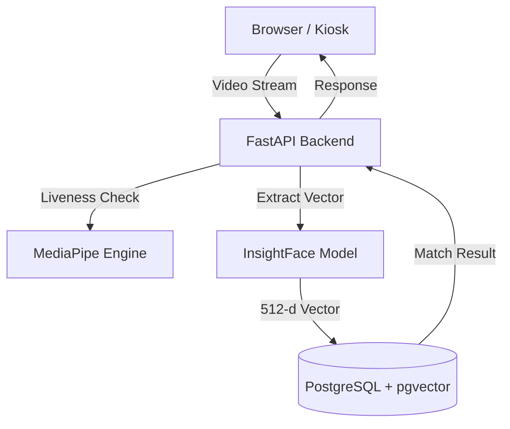

# Product Requirements Document (PRD): Face-Absen

| Metadata | Details |
| :--- | :--- |
| **Product Name** | Face-Absen |
| **Status** | Draft |
| **Date** | 2026-02-04 |
| **Based On** | `implementation-plan.md` |

---

## 1. Executive Summary
**Purpose**: Build a fast, accurate, and privacy-centric on-premise face recognition attendance system to modernization workforce management without relying on external cloud providers.

*   **Problem Statement**: Manual attendance is slow and prone to errors. Fingerprint systems have hygiene concerns. Cloud-based Face Recognition services (SaaS) introduce recurring costs and data privacy risks.
*   **Proposed Solution**: "Face-Absen", a self-hosted implementation using **FastAPI**, **InsightFace** for recognition, and **Video-based Liveness Detection** to prevent spoofing.
*   **Business Impact**:
    *   **Cost Reduction**: Zero recurring cloud API fees.
    *   **Security**: 100% on-premise data storage (GDPR/privacy friendly).
    *   **Efficiency**: Check-in time < 1 second.
*   **Success Metrics**:
    *   Liveness detection accuracy > 95% against photo attacks.
    *   Recognition threshold ≥ 0.6 (Cosine Similarity) with < 1% False Acceptance Rate.
    *   System response time < 1s per transaction.

## 2. Problem Definition
### 2.1 Customer Problem
*   **Who**: Organizations with physical attendance needs (factories, offices, schools).
*   **What**: Need a reliable way to verify presence that is hard to cheat (anti-spoof) and hygienic (contactless).
*   **Why**:
    *   Photo spoofing is easy on simple 2D face systems.
    *   Internet dependency causes failure during outages for cloud systems.
    *   Privacy regulations restrict sending biometric data to 3rd party clouds.

### 2.2 Solution Value
*   **Private**: Data never leaves the local network.
*   **Robust**: Video challenge (blink/head turn) defeats simple print attacks.
*   **Scalable**: Containerized (Docker) deployment on standard hardware.

## 3. Solution Overview
### 3.1 Proposed Solution
A web-based kiosk/tablet application backed by a powerful local inference engine.
*   **Backend**: Python FastAPI handling API requests.
*   **AI Engine**:
    *   **Face Recognition**: ArcFace via InsightFace (buffalo_l model).
    *   **Liveness**: MediaPipe FaceMesh + OpenCV for real-time challenge-response.
*   **Database**: PostgreSQL with `pgvector` for high-speed embedding search (512 dimensions).
*   **Frontend**: Simple HTML/JS interface for camera access and user feedback.

### 3.2 In Scope (MVP)
*   **Employee Enrollment**: Upload ID and face photo to generate and store embeddings.
*   **Live Attendance**:
    *   Real-time camera stream.
    *   Interactive Verification Challenge (e.g., "Please Blink", "Turn Left").
    *   Face Matching against database.
*   **Reporting**: Real-time logging of attendance events with confidence scores.
*   **Deployment**: Docker Compose configuration for immediate setup.

### 3.3 Out of Scope
*   Native Mobile Apps (Android/iOS).
*   Complex HRIS logic (Shift scheduling, Leave management).
*   Multi-camera RTSP Stream processing (CCTV mode).
*   Hardware integration (Turnstiles/Door locks) - *planned for future*.

## 4. User Stories & Requirements
### 4.1 User Stories
| ID | As a... | I want to... | So that... |
| :--- | :--- | :--- | :--- |
| **US-001** | Admin | Enroll an employee with their photo and ID | The system can recognize them later. |
| **US-002** | Employee | Check in by simply looking at the camera | I can mark my attendance quickly without touching devices. |
| **US-003** | System | Challenge the user to perform an action (Blink/Turn) | I can ensure the user is a live person and not a photo. |
| **US-004** | Admin | View a log of attendance | I can verify who was present and when. |
| **US-005** | DevOps | Deploy the system using Docker | I can set it up quickly on our local server without dependency hell. |

### 4.2 Functional Requirements
*   **FR-001 (Vectorization)**: System MUST convert face images into 512-dimensional normalized vectors using ArcFace.
*   **FR-002 (Storage)**: System MUST store vectors in PostgreSQL using the `vector` extension.
*   **FR-003 (Liveness)**: System MUST pass a liveness check (video challenge) BEFORE attempting identification.
*   **FR-004 (Matching)**: System MUST match faces with a Cosine Similarity threshold of ≥ 0.6.
*   **FR-005 (API)**: System MUST provide REST APIs for Enrollment, Liveness Start/Verify, and Final Attendance.

### 4.3 Non-Functional Requirements
*   **Performance**: Liveness processing loop should take 300-500ms per frame.
*   **Capacity**: Support at least 1,000 enrolled employees on a standard CPU-only server.
*   **Privacy**: No biometric data shall be sent to external networks.

## 5. Technical Specifications
### 5.1 Architecture Diagram

### 5.2 API Design (Core Endpoints)
*   **POST** `/enroll`: Handles multipart form data (user_id, image file).
*   **POST** `/liveness/start`: Initiates a session, returns a challenge (e.g., "BLINK").
*   **POST** `/liveness/frame`: Accepts video frames for analysis.
*   **POST** `/liveness/verify`: Confirms if the challenge was met.
*   **POST** `/absen`: The final transaction that combines liveness success with face matching.

### 5.3 Database Schema
*   **Extension**: `vector`
*   **Table `employees`**: `user_id` (Unique Text), `embedding` (vector(512)).
*   **Table `attendance`**: `user_id`, `confidence` (Float), `created_at` (Timestamp).

## 6. Milestones & Timeline
| Phase | Milestone | Description |
| :--- | :--- | :--- |
| **Phase 1** | **MVP** | Core Enrollment, Liveness Detection, Face Matching, Docker Deployment. |
| **Phase 2** | Enhancements | Multi-embedding support (better accuracy), RBAC for Admins, CSV Exports. |
| **Phase 3** | Enterprise | CNN-based passive anti-spoofing, RTSP CCTV integration, Offline Edge Sync. |
