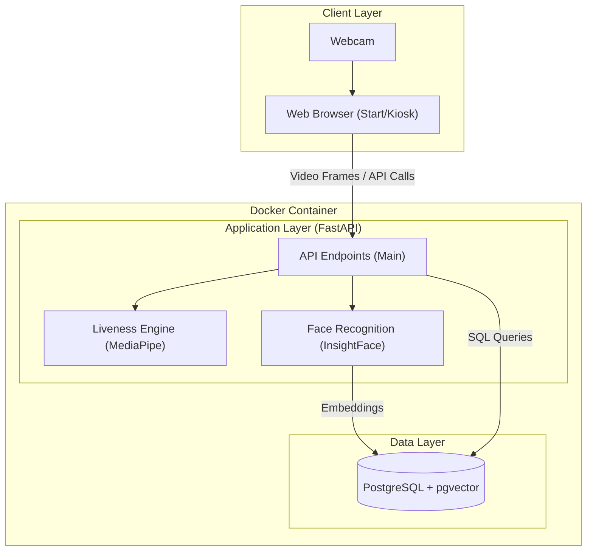

# Technical Requirements Document (TRD): Face-Absen

| Metadata         | Details                                                                                |
| :--------------- | :------------------------------------------------------------------------------------- |
| **Project Name** | Face-Absen                                                                             |
| **Version**      | 1.0.0                                                                                  |
| **Date**         | 2026-02-04                                                                             |
| **Status**       | Draft                                                                                  |
| **Author**       | System Agent                                                                           |
| **References**   | [PRD](../prd/face-absen-prd.md), [Implementation Plan](../plan/implementation-plan.md) |

---

## 1. Introduction

This document outlines the technical specifications for "Face-Absen", a self-hosted, privacy-centric face recognition attendance system. It details the system architecture, component design, data models, and technical standards required for implementation.

## 2. System Architecture

### 2.1 High-Level Architecture

The system follows a monolithic architecture wrapped in a Docker container, designed for on-premise deployment. It consists of a FastAPI backend serving as the core orchestrator, interacting with AI inference engines and a PostgreSQL database.

### 2.2 Component Diagram



## 3. Technical Requirements

### 3.1 Backend Service

- **Framework**: FastAPI (Python 3.10+)
- **Concurrency**: Asynchronous request handling (`async`/`await`) for I/O bound operations (DB, API), synchronous threads for CPU-bound AI tasks if necessary, or leveraging efficient libraries.
- **Type Safety**: Strict type hinting using standard `typing` module, `pydantic` models for validation, and `mypy`/`ty` for static analysis.
- **Dependencies**:
  - `fastapi`, `uvicorn`: Web server.
  - `insightface`, `onnxruntime`: Face recognition.
  - `mediapipe`, `opencv-python`: Liveness detection.
  - `asyncpg`, `databases` or `sqlalchemy`: Database interaction.
  - `pgvector`: Vector search support.

### 3.2 Database

- **Engine**: PostgreSQL 15+
- **Extension**: `pgvector` for 512-dimensional vector storage and similarity search.
- **Schema**: managed via SQL scripts or migration tools (e.g., `alembic`).

### 3.3 AI / Inference

- **Face Recognition**:
  - Model: ArcFace (buffalo_l).
  - Input: Aligned face image.
  - Output: 512D float vector.
  - Performance Target: < 200ms inference time.
- **Liveness Detection**:
  - Method: Active Challenge-Response (Video-based).
  - Framework: MediaPipe FaceMesh.
  - Logic: Real-time landmark tracking to verify challenge completion (e.g., Blink, Turn Left/Right).

### 3.4 Frontend (MVP)

- **Technology**: Standard HTML5, vanilla JavaScript (or minimal framework), CSS.
- **Key APIs**: `navigator.mediaDevices.userMedia` for camera access.
- **Constraints**: Must run in standard modern browsers (Chrome, Edge, Firefox).

### 3.5 Infrastructure & Deployment

- **Containerization**: Docker + Docker Compose.
- **Services**:
  - `backend`: Python application.
  - `db`: PostgreSQL database.
- **Resource Limits**: Configurable CPU/Memory limits in docker-compose.

## 4. Data Design

### 4.1 Database Schema

**Table: `employees`**
| Column | Type | Constraints | Description |
| :--- | :--- | :--- | :--- |
| `id` | SERIAL | PRIMARY KEY | Internal ID |
| `user_id` | TEXT | UNIQUE, NOT NULL | Employee ID (e.g., EMP001) |
| `embedding` | VECTOR(512) | NOT NULL | Face embedding vector |
| `created_at` | TIMESTAMP | DEFAULT NOW() | Record creation time |

**Table: `attendance`**
| Column | Type | Constraints | Description |
| :--- | :--- | :--- | :--- |
| `id` | SERIAL | PRIMARY KEY | Internal ID |
| `user_id` | TEXT | NOT NULL | FK to employees.user_id (conceptual) |
| `confidence` | FLOAT | NOT NULL | Cosine similarity score |
| `created_at` | TIMESTAMP | DEFAULT NOW() | Attendance timestamp |

**Indexes**:

- IVFFlat or HNSW index on `employees(embedding)` for fast cosine similarity search if N > 1000. For MVP (small scale), exact search is acceptable.

## 5. Security & Privacy

- **Data Residency**: All data stored locally. No external usage.
- **Anti-Spoofing**:
  - Session-based challenges (server generates challenge, client must respond).
  - Time-window constraints for challenge response.
- **API Security**: Basic validation of payloads. (Auth/RBAC deferred to Phase 2).

## 6. Code Interface & Standards

Adhere to strict **Python Best Practices**:

- **Typing**: Use `Dataclasses`, `TypedDict`, `Protocol` for clear interfaces.
- **Error Handling**: Explicit error types and handling, no broad `except Exception`.
- **Config**: Environment-based configuration (12-factor app).
- **Testing**: `pytest` for unit and integration tests.

## 7. Folder Structure

The project shall follow this structure to ensure scalability and separation of concerns:

```
face-absen/
├── app/
│   ├── __init__.py
│   ├── main.py            # Entry point & Routes
│   ├── config.py          # Configuration management
│   ├── core/              # Core business logic / Engines
│   │   ├── __init__.py
│   │   ├── face.py        # InsightFace wrapper
│   │   ├── liveness.py    # MediaPipe wrapper
│   │   └── types.py       # Domain types / Protocols
│   ├── db/                # Database layer
│   │   ├── __init__.py
│   │   ├── session.py     # Connection handling
│   │   └── models.py      # Data models
│   ├── api/               # API Route handlers (if splitting main.py)
│   │   ├── __init__.py
│   │   ├── dependencies.py
│   │   └── routes.py
│   ├── schemas/           # Pydantic models (DTOs)
│   │   ├── __init__.py
│   │   └── request.py
│   └── templates/         # HTML Templates
│       ├── upload.html
│       └── attend.html
├── docker/
│   └── init.sql
├── tests/
│   ├── __init__.py
│   ├── test_main.py
│   └── test_core.py
├── .env.example
├── .gitignore
├── Dockerfile
├── docker-compose.yml
├── requirements.txt
└── pyproject.toml         # Tool configuration (ruff, mypy, pytest)
```
